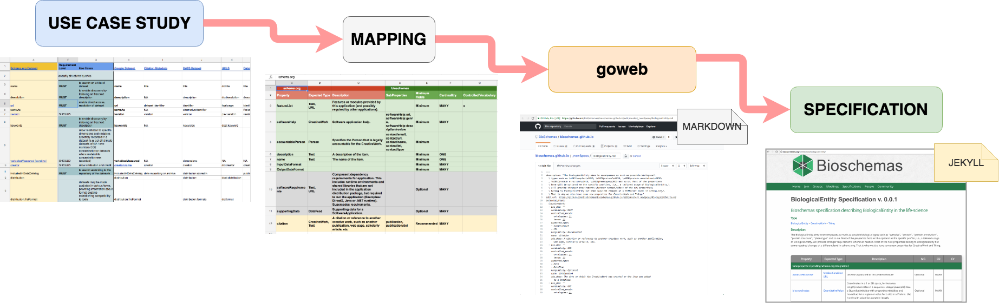

# Bioschemas Governance

**Status:** 1.0 (Released) 

**Contributors:**

* Alasdair Gray, Heriot-Watt University, Edinburgh, UK

* Leyla Garcia, ZB MED Information Centre for Life Sciences, Germany

* Carole Goble, University of Manchester, Manchester, UK

* Nick Juty, University of Manchester, Manchester, UK

* Sirarat Sarntivijai, ELIXIR-Hub, UK

* Sarala Wimalaratne, DataCite, Germany

**Table of Contents**

- [Overview](#overview)
- [Steering Council](#steering-council)
- [Community and Working Groups](#community-and-working-groups)
  - [Creation of a Working Group](#creation-of-a-working-group)
  - [Hibernation of a Working Group](#hibernation-of-a-working-group)
  - [Renaming a Working Group](#renaming-a-working-group)
  - [Returning a Working Group to Activity](#returning-a-working-group-to-activity)
  - [Working Group Membership](#working-group-membership)
- [Role Holder Appointment Process](#role-holder-appointment-process)
- [Role Holder Removal Process](#role-holder-removal-process)
- [Specification Development](#specification-development)
  - [Specification Versioning](#specification-versioning)
  - [Specification Authorship](#specification-authorship)
  - [Profile Development](#profile-development)
  - [Type Development](#type-development)
- [Changing the Governance Documents](#changing-the-governance-documents)
- [Sources](#sources)
- [Version History](#version-history)

## Overview

The Bioschemas Community adheres to the 5 core principles of [OpenStand](https://open-stand.org) ([infographic](https://open-stand.org/infographic-the-5-core-principles-of-openstand/)):

1. Respectful cooperation

    * Respecting the integrity, autonomy and intellectual property rules of standards organisations 

2. Adherence to Fundamental Parameters of Standards Development 

    * Due process: equality and fairness, Broad consensus, Transparency, Balance,  And Openness

3. Collective Empowerment

    * Provide global interoperability, scalability and building blocks for further innovation

4. Availability

    * Make standards specifications globally accessible for all, and provide defined procedures to develop specifications 

5. Voluntary Adoption by the standards market

    * The success of the standard is defined by the market!

Bioschemas community members are expected to adhere to our [Code of Conduct](https://github.com/BioSchemas/governance/blob/master/codeOfConduct.md) at all events, telephone conferences, and other interactions. These are based on the FORCE11 [Code of Conduct](https://www.force11.org/code-conduct).

## Steering Council

The Bioschemas Steering Council is responsible for strategic and organisational planning, high-level oversight of community activities, including the approval and monitoring of profiles, types, and working groups, and promoting Bioschemas activities, as well as protecting its public image and reputation. Members of the Steering Council also serve as advocates and ambassadors for Bioschemas, leveraging their networks to benefit the community’s reputation and extending its impact. The Steering Council executes these responsibilities through a combination of telephone meetings every two months, regular correspondence and collaboration via email, and through online direct messaging platforms. 

The Steering Council will have a minimum of 4 members, one of whom must be the Chair. 

Voting on issues in the Steering Council requires at least 50% of the members of the council to be present and will be carried with a simple majority. In the case of an even split, the Chair will have a casting vote.

The Steering Council representatives take on the following roles associated with steering the community, each with specific, identified responsibilities. Community members who are elected to these roles are expected to provide substantive contributions to the community over the duration of their term. The overall role of the Steering Council is to ensure the long-term stability and growth of the community, and the works that are undertaken.

* Chair: (strategic oversight)

    * Coordination of the Steering Council and community activities;

    * Final authority to make decisions for the community and steering council, where a consensus cannot be reached .

* Training:

    * Oversee the dissemination activities of the community, identify events to engage target communities;

    * Ensure that the training materials developed for the community are of a high standard, and are kept up-to-date with evolving specifications;

    * Support making the training material widely available.

* Engagement and Adoption:

    * Encourage specific life sciences resources to embed Bioschemas compliant markup within their web pages;

    * Recruit individuals to engage and work practically with the Bioschemas community to advance their requirements into an implementable specification.

* Support Tools:

    * Oversee the development and promotion of tools to support the community;

    * Ensure that the tools developed for the community are of a high standard, and are kept up-to-date with the evolving specifications;

    * Support making the tools widely available;

    * Develop (with ‘Training Coordinator’) best practices (including documentation) for producing and consuming Bioschemas markup.

* Research Infrastructure Liaison

    * Promote Bioschemas approach for use in other communities, spanning scientific domains, facilitating a broadly interoperable landscape of metadata strategy and tooling;

    * Represent the community in forums such as the Research Data Alliance (RDA), working with cross-disciplinary partners.

* Operations Manager 

    * Operational oversight of the working groups, monitoring progress, and ensuring that issue tracker tickets are appropriately assigned and completed in a timely manner;

    * Point of contact between Working Group Leads and the Steering Council;

    * Keep the Bioschemas web site up-to-date.

* Community Members

    * Support the roles specified above

See the [Role Holder Section](#heading=h.n3000j53zrj0) for the processes to add and remove members of the Steering Council.

## Community and Working Groups

The community conducts the day-to-day activities for Bioschemas, namely, profile and type development and adoption according to the processes defined by the Bioschemas Community (see [Specification Development](#heading=h.jwagq5rseict)). This community work is split across working groups, each with a specific focus and each led by two individuals from the community. Working groups are a group of individuals who coalesce around an identified need to exploit Bioschemas markup. The working group establishes markup practices for a particular concept, e.g. Gene or Protein, under the umbrella Bioschemas community. The Working Group Leads are agreed upon by the members of that particular group of individuals. Each working group prepares releases of the profiles and types under its remit for the approval of the Steering Council.

Voting on issues in a Working Group will be carried with a simple majority of those members present. In the case of an even split, the Working Group Leads will have a casting vote. If this does not resolve the issue then it should be raised to the Steering Council.

The Working Group Leads are responsible for overseeing the work of the group and take on the editorial roles of the profiles and types within the working group remit. The Working Group are responsible for:

* Development and maintenance of profiles and types within the remit of the working group, as agreed with the Steering Council;

* Promoting the adoption of the profile by engaging appropriate resources and data owners;

* Ensuring that GitHub issues assigned to the group are resolved in a timely manner, through traceable means (scheduled calls, direct email or messaging).

See the [Role Holder Section](#heading=h.n3000j53zrj0) for the processes to add and remove a Working Group Lead.

### Creation of a Working Group

A Working Group may be established when a group of individuals identify a perceived need for consuming mark up for a Life Sciences resource that is not satisfied using existing Bioschemas profiles. 

The creation of a working group needs to be approved by the Steering Council. The proposal of a working group must:

* Define the use cases for the consumption of the markup;

* Propose the profiles that they would develop to satisfy the use cases, including the Schema.org types to be extended or developed;

* Identify group members and provisional working group leads.

Working Group Leads are agreed upon by the members of the working group using the processes defined in the [Role Holder Section](#heading=h.n3000j53zrj0).

### Hibernation of a Working Group

Working Group Leads can nominate their group for hibernation by contacting the Steering Council Chair with details of how they have completed their work. It would be expected that all profiles had reached a release status or been deprecated, i.e. none in a draft state, and that all issues in the tracker had been closed. Upon a Steering Council vote, the group would be placed into hibernation with the expectation that if new issues were raised that the group could be reconvened. If the Steering Council decides that a group should not be put into hibernation then a suitable action plan with the Working Group Leads or other members of the community needs to be put into place.

The Steering Council can also consider for hibernation working groups that have not been active for a period of 6 months, evidenced through commits and correspondence. The Steering Council Chair will contact the Working Group Leads to see if the group plans to return to an active state. If there is no plan, then the group will be put into hibernation upon a Steering Council vote. If they plan on returning to activity, they will be given a grace period of 3 months. If no activity is seen, they may be put into hibernation by vote of the Steering Council without further consultation.

Upon hibernating a working group, the Steering Council will consider whether the profiles developed by the group should be deprecated (see [Deprecating a Profile](#heading=h.ipd8q1hfpsr7)), typically this will apply to any profile that is in draft form but has not been released, and closing all outstanding issues.

### Renaming a Working Group

If a working group decides that they should be renamed, they should inform the Steering Council Chair and provide motivation for the name change. The Steering Council will consider the request and vote on the decision. They will then inform the Working Group Leads of the outcome. If approved, the name change will be reflected on the Bioschemas website, with a suitable redirection setup from the old group page.

### Returning a Working Group to Activity

Working groups that are in hibernation can return to activity. To do so, either the existing Working Group Leads or members of the community who are willing to take on the role of Working Group Lead, must contact the Steering Council Chair with a plan for the working group activity. The plan should outline the need for the working group to return to activity, propose members of the community who will carry out the work, and a timetable for the work. The group can be reinstated upon a vote of the Steering Council.

### Working Group Membership

Bioschemas is an open community to which anyone may provide input to any working group. The working group web page will list those members who are currently active in the discussions and work of the group. 

The group page can also contain a list of former group members, i.e. those who have previously been involved in the group’s activities but have not contributed within the last 6 months. The Working Group Leads are responsible for maintaining the list of active and former group members.

Appeals for inclusion where someone feels they have been overlooked should go to the Steering Council Chair, who shall have the final decision in cases of disagreement with the Working Group Leads.

## Role Holder Appointment Process

Steering Council ‘Role Holders’ and Working Group Leads are elected positions, with a 2 year term of service. Incumbents may continue in post if successfully reelected and may resign from post with a three month service period. 

Three months prior to the end of a term, any open  position will be advertised through the Bioschemas mailing list with a 4 week period for candidates to put themselves forward. Candidates must already be involved in the Bioschemas community at the time a role becomes available. Elections will be carried out through an appropriate poll system with details distributed through the Bisochemas mailing list. The poll will remain open for two weeks, and the results will be ratified by the Steering Council and subsequently announced through the Bioschemas mailing list and website. The new role holder takes over the position at the end of the previous holder’s term of office, or earlier if mutually agreed.

## Role Holder Removal Process

If a role holder (Steering Council member or Working Group Lead) becomes inactive in their role for a period of 6 months, they will be considered for removal from that role. Inactivity may be indicated by a lack of profile or type development or discussion, for instance, evidenced by a lack of traceable activity (email, tracker updates, commits, etc.). Indicators of inactivity should be reported to any member of the Steering Council for escalation to the Chair. Before removal, the inactive member will be approached by the Steering Council Chair to see if they plan to return to active participation. If not, they will be removed immediately upon a Steering Council vote. If they plan on returning to active participation within a reasonable timeframe (as determined by the Steering Council), they will be given a grace period of 3 months. If they don’t return to active participation within that time period, they will be removed by a vote of the Steering Council without further consultation.

If the Steering Council Chair becomes inactive, the Steering Council may approach the Chair to resolve the issue, as indicated above. Furthermore, the Steering Council are empowered to call where necessary an urgent meeting without the Chair which needs 75% of the remaining council members present, where an unanimous decision can be made to replace the Chair immediately. 

If a Working Group Lead is removed from post it is expected that the other Working Group Lead will cover all leadership activities in the group until a new co-lead is appointed. The Steering Council can also appoint a temporary Working Group Lead to help cover group leadership activities until such time that a formal election is run.

All former role holders can be considered for membership again at any time in the future. Retired role holders will be listed on the project website, acknowledging the period of their service and role.

The Steering Council reserves the right to eject current role holders if they are deemed to be acting in a manner deemed to be detrimental to the community’s well-being or reputation, and where attempts at communication and conflict resolution have failed.

## Specification Development

Within the Bioschemas community the term specification refers to either a profile or a type. These are developed within the remit of a working group according to the governance structures outlined here.

The development of a specification should be a collaborative effort engaging with the community through the [public mailing list](https://lists.w3.org/Archives/Public/public-bioschemas/) and the community [Issue Tracker](https://github.com/BioSchemas/specifications/issues). The latest working version of a draft specification can be shown in the draft section of the [Profiles](http://bioschemas.org/profiles/) or [Types](https://bioschemas.org/types/) page of the Bioschemas website without requiring approval of the Steering Council. Specifications can only reach release status by approval of the Steering Council.

### Specification Versioning

A specification version number consists of the following parts, with hyphens between the parts:

`<major-number>.<minor-number>-[DRAFT|RELEASE]-<yyyy>_<mm>_<dd>`

Each time a specification (profile or type) is published to the Bioschemas website, it must have a unique version number, a designation of whether it is a draft or release version, and the date of the version is published encoded as the four digit year, underscore, two digit month, underscore, two digit day. 

Release versions of a specification will increment the major number and reset the minor number to 0, i.e. the first time a specification is released it will get the number 1.0, the next release will be designated 2.0, and so on. Note that some releases prior to 1 January 2020 do not follow this convention but are compatible with it.

Draft versions of a specification will increment the minor number, with the major number corresponding to the release that they are building upon. The first draft of a specification will be designated 0.1, with subsequent versions being 0.2, 0.3, etc until the first release. After the first release the numbering for further draft versions will be 1.1, 1.2, etc.

### Specification Authorship

The acknowledgement of contributions to a specification will be recognised on the Bioschemas website page displaying the specification. Names can be added on each iteration of a draft. It is expected that names would remain until the specification makes it to release status to acknowledge an individual’s contribution towards the release. Upon evolving a release version, the Working Group Leads should review the author list and include those who are contributing to the next release.

Contributors include, but are not limited to, the members of the group. Those who have been actively involved in the discussions, development and support will also be acknowledged. The decision on whether sufficient contribution has been made for an individual to warrant inclusion in this listing is within the remit of the Working Group Leads. Appeals for inclusion where someone feels they have been overlooked should go to the Steering Council Chair, who shall have the final decision in case of disagreement with the Working Group Leads.

### Profile Development

The workflow for the development of a profile is shown in the figure below and outlined in the following text. 

The development steps for a profile are:

1. Identify the base Schema.org type for the profile, or develop a new Bioschemas type (see [Type Development](#heading=h.khkzogq968jx));

2. For each property defined for the type

    1. Decide its cardinality recommendation (minimal, recommended, or optional) based on the defined use cases, with a goal of having no more than 6 minimal properties;

    2. Identify, where appropriate, controlled vocabulary terms from existing domain vocabularies to use as values for the property;

    3. Provide an example of the usage of the term;

    4. Map the property to widely used ontology terms in the domain;

    5. Optionally provide a clarification description of how to use the property within the Life Sciences (NOTE:  Note that this can only narrow the definition within the life sciences community, not redefine the property.).

3. Ensure that the use case is sufficiently covered, and if required propose new properties for the type;

4. Publish the profile to the draft section of the Bioschemas Profiles page, each published draft should have a unique version number;

5. Validate the profile with sample markup;

6. Deploy markup conforming to the latest draft on at least two resources.

For detailed instructions of how to develop and publish a Bioschemas profile, please see the [Profile Development Process page](https://github.com/BioSchemas/specifications/wiki/Bioschemas-Profile-Development-Process) on the [Bioschemas technical wiki](https://github.com/BioSchemas/specifications/wiki). 

#### Proposing a New Profile

New profiles need to be approved by the Steering Council. The Working Group Leads should inform the Steering Council Operation Manager of the newly identified need for a profile based on their working group use cases. The Steering Council will consider this request and inform the Working Group Leads of the outcome which can consist of approving the new profile, rejecting the new profile, asking for revisions, or proposing the development of a new working group.

Note that part of creating a new working group includes approving a set of profiles that it will develop. These profiles do not need further approval for their development to commence.

The Operation Manager will work with the Working Group Leads to create the relevant files for the development of the profile.

#### Renaming a Profile

If a working group decides that a profile should be renamed, they should inform the Steering Council Operation Manager and provide motivation for the name change. The Steering Council will consider the request and vote on the decision. They will then inform the Working Group Leads of the outcome.

The existing profile will be deprecated with a link added to the new profile. The new profile will continue the version numbering from the previous name, and include a link back to the deprecated profile.

#### Deprecating a Profile

If a working group decides that a profile is no longer required, e.g. the work undertaken was deemed unsatisfactory, or failed to accomplish the desired objective(s), or has been superceded by some other activity, then the Working Group Leads should inform the Steering Council Operation Manager and include a justification for the Working Group’s decision. The Steering Council will consider the request and vote upon it. They will then inform the Working Group Leads of the outcome.

The Steering Council may also decide that a profile should be deprecated. This will be in the case that there has been no active development in the last 6 months on the draft profile. The Steering Council Operation Manager will contact the Working Group Leads responsible for the profile to see if the group plans to further develop the profile. If there is no plan, then the profile will be deprecated upon a Steering Council vote. If the Working Group plan on returning to developing the profile, they will be given a grace period of 3 months. If no activity is evident, then the profile may be deprecated by vote of the Steering Council without further consultation.

#### Releasing a Profile

Changing a profile from draft to release requires a vote of approval by the Steering Council. 

To satisfy the Steering Council a profile must minimally have:

* A use case document specifying consumption scenarios.

* A Crosswalk mapping file with a maximum of 6 minimal properties, examples for each property at the minimum and recommended levels, a mapping of the minimum and recommended terms to equivalent terms in domain ontologies.

* Relevant issues closed on the issue tracker and noted in the crosswalk document.

* Examples of sample markup in the examples folder corresponding to the specific version. These must be updated to the latest version of the profile or deprecated.

* ‘Live deploys’ listing resources that are using the latest version of the profile. There should be at least two independent deployments of the latest version of the profile.

* A section in the Bioschemas training materials for deploying markup of the profile updated to the latest release. 

When a working group decides that their draft profile meets these requirements, the Working Group Leads shall inform the Steering Council Operation Manager to have the draft profile made into a release. The Operation Manager will ensure that the profile meets the criteria for being released and inform the wider Bioschemas community through the mailing list of the desire to release the profile. The community will be given 2 weeks to comment on the profile.

After any issues raised by the Bioschemas community have been addressed, the Steering Council will vote to decide whether to accept the profile for release. If successful, the relevant metadata about the profile status and version number are updated, and the profile published to the release section of the Bioschemas website on the [profiles page](http://bioschemas.org/profiles/), with a release version identifier, i.e. the 0.8-DRAFT would become 1.0 or 1.4-DRAFT would become 2.0.

### Type Development

The development of a type follows the procedures of the [Schema.org](schema.org) community. 

In the following, the term ‘Bioschemas type’ means a type that is being developed within the Bioschemas community with the aim of integration within the Schema.org vocabulary.

#### Editing an Existing Schema.org Type

Adding new properties to existing Schema.org types should be discussed with the Steering Council prior to being carried out following the Schema.org development process, i.e. an issue should be raised on the Schema.org issue tracker and discussions carried out with the wider Schema.org community. 

Adding Bioschemas types in the expected types of existing Schema.org types will be carried out on the inclusion of the Bioschemas type into the Schema.org vocabulary; see [Releasing a Type](#heading=h.yakcmtxgrkm6) for more details.  

#### Proposing a New Bioschemas Type

New types need to be approved by the Steering Council. The Working Group Leads will inform the Steering Council Operation Manager of the newly identified need for a type based on their working group use cases, with supporting evidence and documentation. The Steering Council will consider this request and inform the Working Group Leads of the outcome which can consist of approving the new type, suggesting the extension of an existing type, or rejecting the new type.

Note that approval of new types can be granted as part of creating a new working group. In this case, the types do not need further approval.

The Operation Manager will work with the Working Group Leads to create the relevant files for the development of the type.

#### Renaming a Bioschemas Type

If a working group decides that a type should be renamed, they should inform the Steering Council Operation Manager and provide motivation for the name change. The Steering Council will consider the request and vote on the decision. They will inform the Working Group Leads of the outcome.

If successful, the existing type will be deprecated with a link added to the new type. The new type will continue the version numbering from the previous type and include a link back to the deprecated type.

#### Deprecating a Type

If a working group decides that a type is no longer required, e.g. the activity did not conclude, then the Working Group Leads should inform the Steering Council Operation Manager and include a justification for the working group’s decision. The Steering Council will consider the request and vote on the request. They will then inform the Working Group Leads of the outcome.

The Steering Council may also decide that a type should be deprecated. This will be in the case that there has been no active development in the last 6 months on the draft type. The Steering Council Operation Manager will contact the Working Group Leads responsible for the type to see if the group plans to further develop the type. If there is no plan, then the type will be deprecated upon a Steering Council vote. If the working group plan on returning to developing the type, they will be given a grace period of 3 months. If no activity is seen, then the type may be deprecated by vote of the Steering Council without further consultation.

#### Releasing a Type

Changing a type from draft to release requires a vote of approval by the Steering Council. To satisfy the Steering Council, a type must minimally have:

* A defined location in the Schema.org hierarchy. This may be below another Bioschemas type.

* A description that succinctly defines the type and is not open ended.

* For each property

    * A property name conforming with Schema.org practices;

    * A non-empty set of expected types;

    * A description for the property conforming with Schema.org practices.

* Relevant issues closed on the issue tracker.

* Release notes with a summary of the changes since the last release, links to the main discussions for the type (issue tracker and mailing list), a list of vocabularies considered in the development of the type, and a list of any Schema.org properties that need to have the type included in their range declaration.

When a working group decides that their draft type meets these requirements, the Working Group Leads inform the Steering Council Operation Manager to have the draft type made into a release. The Operation Manager will check the type meets the above criteria for being released and inform the wider Bioschemas community through the mailing list. The community will be given 2 weeks to comment on the type. The Steering Council may also work with the Schema.org leadership group to ensure that the definition of the type conforms with the Schema.org community practice.

After any issues raised by the Bioschemas community have been addressed, the Steering Council will vote to decide whether to accept the type for release. If successful, the relevant metadata about the type status and version number are updated, and the type published to the release section of the Bioschemas website on the [types page](https://bioschemas.org/types/).

## Changing the Governance Documents

Future changes to these governance documents are to be submitted via a GitHub pull request to the Bioschemas Governance GitHub repository at [https://github.com/bioschemas/governance](https://github.com/bioschemas/governance). The pull request is then refined in response to public comment, open for a minimum of 4 weeks, and review, with the goal being consensus in the Bioschemas community. After this open period, a Steering Council Member proposes to the Steering Council that the changes be ratified and the pull request merged (accepting the proposed changes) or proposes that the pull request be closed without merging (rejecting the proposed changes). The Member should state the final commit hash in the pull request being proposed for acceptance or rejection and briefly summarize the pull request. A minimum of 80% of the Steering Council must vote and at least 2/3 of the votes must be positive to carry out the proposed action (fractions of a vote rounded up to the nearest integer). In exceptional circumstances the Steering Council Chair has authority to act alone in accepting or rejecting changes or overriding Steering Council decisions.

## Sources

FORCE11:

* Mission and Guiding Principles: [https://www.force11.org/about/mission-and-guiding-principles](https://www.force11.org/about/mission-and-guiding-principles)

* Code of Conduct: [https://www.force11.org/code-conduct](https://www.force11.org/code-conduct)

Jupyter Governance: [https://jupyter.org/about](https://jupyter.org/about) ([May 2019 version](https://github.com/jupyter/governance/blob/06db2fec99c90f90aa1434f0b61054a9771a2bfd/governance.md))

Software Carpentry Governance: [https://carpentries.org/governance/](https://carpentries.org/governance/)

W3C Consortium Process Document: [https://www.w3.org/2019/Process-20190301/](https://www.w3.org/2019/Process-20190301/)

## Version History

<table>
  <tr>
    <td>Version</td>
    <td>Date</td>
    <td>URL</td>
  </tr>
  <tr>
    <td>0.6</td>
    <td>2020-03-24</td>
    <td>https://github.com/BioSchemas/governance/blob/v0.6-draft/governance.md</td>
  </tr>
  <tr>
    <td>0.5</td>
    <td>2020-02-24</td>
    <td>https://docs.google.com/document/d/1e53CZroEOP2vzLkk3mwJkyT5kYXWiX3R4a5_TIsQkSY/edit?usp=sharing </td>
  </tr>
  <tr>
    <td>0.4</td>
    <td>2019-12-20</td>
    <td>https://docs.google.com/document/d/1K8kHDMWEk2rIqy1q1D_UJG-nKnz5C3xN9XoBT_w0poQ/edit?usp=sharing </td>
  </tr>
  <tr>
    <td>0.3</td>
    <td>2019-11-26</td>
    <td>https://docs.google.com/document/d/1-oWZEAHNnSIVqsY_kJwdpvHbYYY_vL0cXvveQcQz2eY/edit?usp=sharing </td>
  </tr>
  <tr>
    <td>0.2</td>
    <td>2019-10-24</td>
    <td>https://docs.google.com/document/d/12VYAlvlv-AXbD-hyeS4wVPhjXnSM3wyBMAh3LOifptc/edit?usp=sharing </td>
  </tr>
  <tr>
    <td>0.1</td>
    <td>2018-09-28</td>
    <td>https://docs.google.com/document/d/1037AGHpuwfrOyCiz1hpy3yNVyAT1F-kuDFeeXZLYDcw/edit?usp=sharing </td>
  </tr>
</table>

